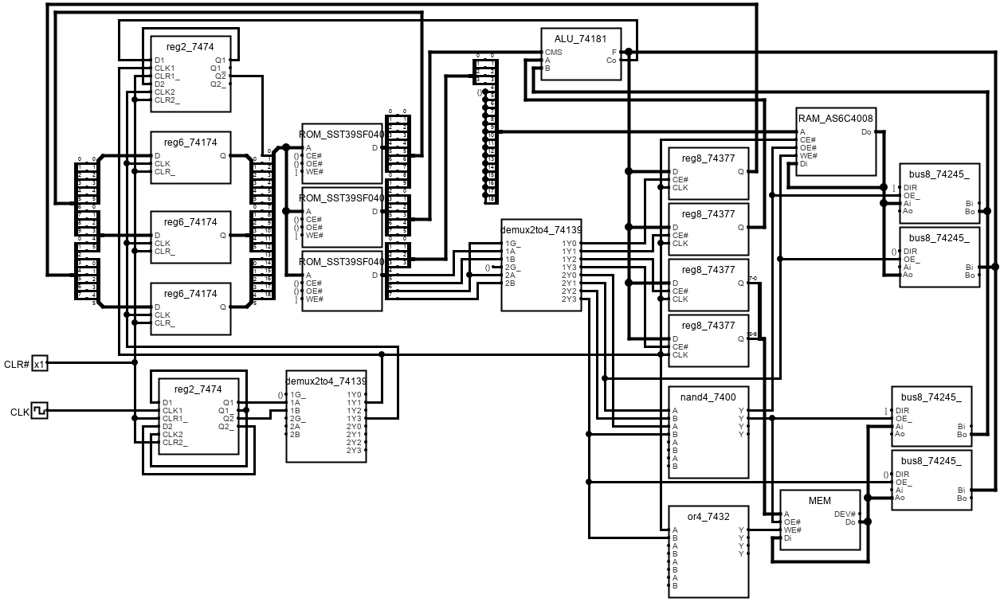

# BreadBoardCPU (BBCPU)

這個專案的目標是用基本的邏輯晶片(最複雜到 ROM、SRAM)，
在麵包板上完成一個全功能的 CPU。

## Introduction

專案包含設計所需要的所有程式碼，皆以 C++ 撰寫而成。
共分4個函數庫，在`include/`資料夾下。

1. `sim/` 簡易的數位電路模擬，支持三態邏輯
2. `cpu/` CPU 電路、微碼與指令集設計
3. `asm/` 組譯器基本功能
4. `lang/` 嵌入 C++ 的 C-like DSL

## Current Progress

能獨立運作並在LCD上印出"Hello, world!"


## Simulation

在`sim/`資料夾下，為簡易的數位電路模擬，支持三態邏輯。

為了驗證電路設計而寫，原先使用的 logisim 部分功能無法滿足而做。
可用 verilog 替代，自己寫主要是為了跟原有的 C++ 程式結合。

主要類別為`Chip`與`Circuit`。
`Chip`是最基本的單位，寫法如下。
```c++
template<size_t Size>
struct Adder:Chip{
    Port<Size> A{Mode::IN,"A"},B{Mode::IN,"B"},O{0,"O"};
    explicit Adder(std::string name=""):Chip(std::move(name)){
        add_ports(A,B,O);
    }
    void run() override{
        O=A.value()+B.value();
    }
    Util::Printer print(std::span<const Level> s) const override{
        return [=](std::ostream& os){
            os<<A(s)<<"+"<<B(s)<<"="<<O(s);
        };
    }
};
```

`Circuit`由多個`Chip`與`Circuit`組合成，
呼叫`run()`會運行電路至穩定態。
```c++
template<size_t Size>
struct Accumulator:Circuit{
    Clock clk{Level::PullDown};
    Port<1> clr{Level::PullUp};
    Adder<Size> adder{name+"[Adder]"};
    RegCLR<Size> reg{name+"[Reg]"};
    explicit Accumulator(std::string name=""):Circuit(std::move(name)){
        add_comps(adder,reg);

        clk.wire(reg.clk);
        clr.wire(reg.clr);
        adder.O.wire(reg.D);
        adder.A.wire(reg.Q);
        adder.B.set(1);
    }
    Util::Printer print() const override{
        return [&](std::ostream& os){
            os<<"adder="<<adder<<"reg="<<reg;
        };
    }
};
int main(){
    Accumulator<8> cnt;
    for(int i=0;i<10;i++){
        cnt.update();
        std::cout<<cnt<<std::endl;
        cnt.clk.clock();
    }
    return 0;
}
```

## CPU Design

在`cpu/`資料夾下，為CPU 電路、微碼與指令集設計

目前有兩套設計`regfile8x16/`與`regset_sram/`，在各自的資料夾下分別有：
1. `xxx/regs.h` 暫存器定義
2. `xxx/marg.h` 微碼參數(輸入)定義
3. `xxx/mctrl.h` 微碼控制(輸出)定義
4. `xxx/mcode.h` 微碼功能、輔助函數
5. `xxx/cpu.h` CPU電路設計

兩套設計共用同一個指令集，定義在`opcode.h`
`regset_sram/` 的設計如下圖所示


## Assembler

在`asm/`資料夾下，為組譯器設計提供基本功能。

因為懶得處理字串，所以設計成函數庫而非獨立程式，只負責指令集的包裝與`Label`的定位，但之後也可以直接讓獨立前端呼叫使用。

### Example
```c++
using namespace BBCPU::ASM;
using BBCPU::ASM::Impl::CPU;

Label start,end;
auto program=Code{
    imm(Reg::B,3),
    imm(Reg::A,0),
    start,
    push(Reg::B),
    brz(end),
    push(Reg::A),push(Reg::B),add(),pop(Reg::A),
    push(Reg::B),imm(1)      ,sub(),pop(Reg::B),
    jmp(start),
    end,
    halt(),
}.assemble();
std::cout<<program<<std::endl;

//simulation
CPU cpu{};
cpu.load(program);
for(int i=0;i<100;i++){
    cpu.tick_op();
    std::cout<<i<<std::endl;
    std::cout<<cpu<<std::endl;
    if(cpu.is_halt()){
        break;
    }
}
```

## Programming Language

在`lang/`資料夾下，為嵌入 C++ 的 C-like DSL。

承襲`asm/`不想處理字串的思路，原本只想做成 Code Generator 讓編譯器呼叫使用，暫時可以手動建立 AST 呼叫。
但是後來因為好玩，不由自主地加入太多編譯期檢查，導致需要一定程度的改寫才能由編譯器前端動態呼叫。

目前支持
* `i8`、`u16` 等整數類型
* `Struct<u8,u8>`、`Array<u8,3>`、`Union<u8,i16>` 等結構類型
* `Fn<void_(u8,u8)>` 自訂函數
* `ptr<u8>`、`ptr<Fn<void_(u8)>>` 指標與函數指標
* `StaticVars`、`ReadOnlyVars` 變數空間管理
* `if-elif-else` 流程控制
* `for`、`while`、`do-while` 迴圈控制
* `break`、`continue` 跳出、繼續迴圈語句

### Example
```c++
using namespace BBCPU::Lang;
using BBCPU::Lang::Impl::CPU;
using MEM=decltype(CPU{}.mem);

//define custom type
struct Vec:Struct<u8,u8,u8>{
    #define THIS Vec
    #define BASE Struct<u8,u8,u8>
    #define members M(x) M(y) M(z)
    #include "lang/define_members.h"
};

//variable allocator
StaticVars svar;
ReadOnlyVars rovar;

//variable declaration
u8 static_var =svar= 5_u8;
u8 const_var =rovar= Vec(1_u8,2_u8,3_u8);

//function declaration
Fn<u8(u8)> fib{};
Fn<u8(u8,u8)> sum{};

CPU cpu{};
cpu.load(svar,MEM::ram_min);//space for StaticVars (should in RAM)
auto program=Code{
    svar.init,//initialize StaticVars (save to RAM)
    static_var=static_var+rovar.x,//use of variable and custom type
    fib(6_u8),//function call
    sum(0_u8,3_u8),
    halt(),
    rovar,//space for ReadOnlyVars (should not run)
    //function implementation
    fib.impl([&](auto& _,u8 i)->Stmt{
        return {
            if_(i < 2_u8).then({
                _.return_(i),
            }).else_({
                _.return_(fib(i - 1_u8) + fib(i - 2_u8)),
            }),
        };
    }),
    sum.impl([&](auto& _,u8 start,u8 end)->Stmt{
        u8 res{_};//local variable declaration
        u8 i{_};
        return {
            res=0_u8,
            for_(i=start,i<=end,i+=1_u8).do_({
                res+=i,
            }),
            _.return_(res),
        };
    }),
}).run_to_halt();
```